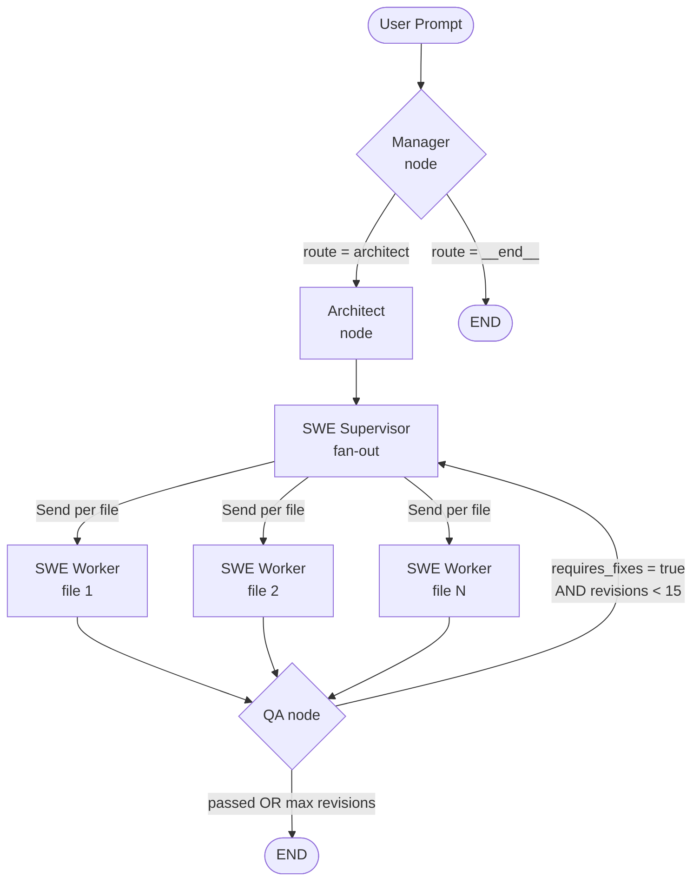

# Backend Engine Architecture

## Overview

The backend engine is a **LangGraph-powered multi-agent orchestration system**. Given a single user prompt (e.g. *"Build an MVP for a todo-list app"*), it coordinates four specialist AI agents — Manager, Architect, SWE workers, and QA — to produce a fully-implemented, tested codebase.

---

## How It Works

### 1. Entry point (`main.py`)

The user runs:
```
python main.py "Build an MVP for <your idea>"
```
`main.py` compiles the LangGraph graph, seeds the initial `GraphState`, and streams execution node-by-node, progressively writing generated files to the `output/` directory.

---

### 2. LangGraph Graph

The graph is built in `packages/orchestrator/src/graph.py` and contains five nodes wired together with conditional routing and a feedback loop:

```
START → manager → architect → swe_supervisor ─┬→ swe_worker (×N, parallel)
                                               │                       │
                                               └──── qa ←──────────────┘
                                                     │
                                               ┌─────┴──────────────┐
                                          requires_fixes?          done?
                                               │                    │
                                        swe_supervisor            END
```

#### Full Mermaid Diagram



---

### 3. Node-by-Node Description

| Node | File | What it does |
|------|------|--------------|
| **Manager** | `nodes/manager.py` | Receives the raw user prompt. Uses Gemini LLM to produce a `manager_plan` (high-level task breakdown) and sets `department_route` to either `"architect"` (development request) or `"__end__"` (non-dev request). |
| **Architect** | `nodes/architect.py` | Reads the `manager_plan` and uses Gemini to produce an `ArchitectResult`: a file plan (list of files to create) plus interface contracts. Populates `files_to_implement`. |
| **SWE Supervisor** | `graph.py` (`swe_supervisor_node`) | A lightweight fan-out node. Uses LangGraph's `Send` primitive to spawn one `swe_worker` node **per file** in `files_to_implement`, running them in parallel. |
| **SWE Worker** | `nodes/swe_group.py` | Each worker receives a single target file path, the architecture plan, and fix instructions. Calls Gemini to generate the code for that file and appends a `SWEResult` to `swe_results`. |
| **QA** | `nodes/qa.py` | Reviews all generated code against the architecture contracts and user prompt. Sets `requires_fixes = True` and writes `fix_instructions` if issues are found. Appends a `QAResult` to `qa_results`. |

---

### 4. State (`GraphState`)

All nodes share a single typed state object defined in `packages/orchestrator/src/state.py`:

| Field | Type | Description |
|-------|------|-------------|
| `user_prompt` | `str` | The original user prompt |
| `messages` | `list` (append-only) | Execution log messages |
| `manager_plan` | `str` | High-level plan from Manager |
| `department_route` | `str` | `"architect"` or `"__end__"` |
| `architecture_plan` | `ArchitectResult` | File plan + interfaces from Architect |
| `files_to_implement` | `List[str]` | Files the SWE workers must create |
| `swe_results` | `List[SWEResult]` (append-only) | Code produced by each SWE worker |
| `qa_results` | `List[QAResult]` (append-only) | QA pass/fail results per review cycle |
| `requires_fixes` | `bool` | Whether QA found issues |
| `fix_instructions` | `str` | Instructions from QA for the SWE workers |

---

### 5. The QA Feedback Loop

After all SWE workers finish, **QA** reviews the combined output. If it finds problems:

1. `requires_fixes` is set to `True`
2. `fix_instructions` is written with precise guidance
3. The graph re-routes back to `swe_supervisor`, which re-spawns workers to fix each file

This loop continues until QA passes **or** 15 revision cycles are reached (guardrail to prevent infinite loops).

---

### 6. LLM Layer (`packages/core/src/llm_client.py`)

All agents call Google Gemini through a shared `LLMClient` wrapper. Role-specific system prompts are loaded from the `prompts/` directory:

| Prompt file | Used by |
|-------------|---------|
| `prompts/manager.md` | Manager node |
| `prompts/architect.md` + `architect-instance.md` | Architect node |
| `prompts/swe.md` + `swe-worker.md` | SWE worker nodes |
| `prompts/qa.md` + `qa-worker.md` | QA node |

---

### 7. Output

As the graph streams execution, generated files are progressively written to the `output/` directory. The final pass after `END` writes the latest version of every file, deduplicating by file path so only the most recent revision is kept.

---

## Summary

```
User Prompt
    │
    ▼
┌─────────────────────────────────────────────────────┐
│  LangGraph Engine                                   │
│                                                     │
│  Manager ──► Architect ──► SWE Supervisor           │
│                                 │                   │
│                    ┌────────────┼────────────┐      │
│                    ▼            ▼            ▼      │
│               SWE Worker   SWE Worker   SWE Worker  │
│               (file 1)     (file 2)     (file N)    │
│                    └────────────┼────────────┘      │
│                                 ▼                   │
│                              QA Agent               │
│                          ┌────┴────┐                │
│                      fixes?     passed?             │
│                          │         │                │
│                    (loop back)    END               │
└─────────────────────────────────────────────────────┘
    │
    ▼
output/ (generated MVP files)
```

The engine simulates a real software development organization: a Manager plans, an Architect designs, a team of SWE workers implement in parallel, and a QA agent reviews and drives revision cycles — all powered by Gemini and orchestrated with LangGraph.
